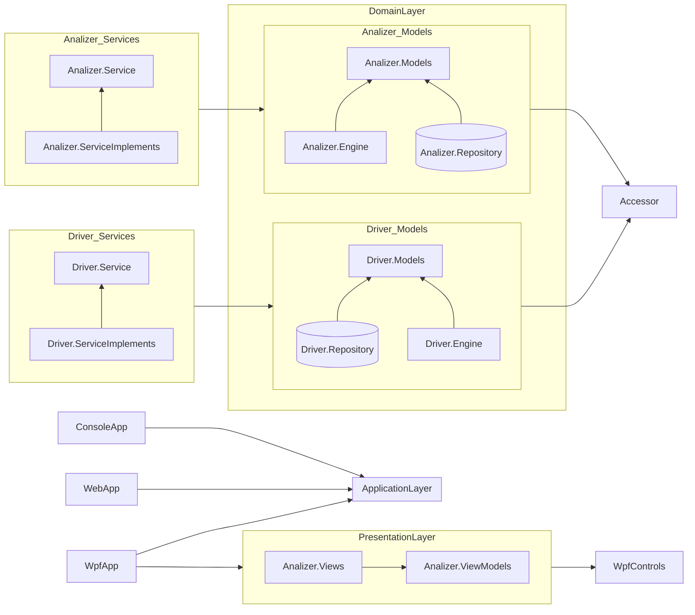

```mermaid
flowchart LR
    
    Analizer_Models --> Accessor
    Driver_Models --> Accessor
    PresentationLayer --> WpfControls

    subgraph DomainLayer
        subgraph Analizer_Models
            direction BT
            Analizer.Engine --> Analizer.Models
            Analizer.Repository[("Analizer.Repository")] --> Analizer.Models
        end
        subgraph Driver_Models
            direction BT
            Driver.Repository[("Driver.Repository")] --> Driver.Models
            Driver.Engine --> Driver.Models
        end
    end
    
    subgraph ApplicationLayer
        
        
    end

    subgraph Analizer_Services
        direction BT
        Analizer.ServiceImplements --> Analizer.Service
    end
    Analizer_Services --> Analizer_Models

    subgraph Driver_Services
        direction BT
        Driver.ServiceImplements --> Driver.Service
    end
    Driver_Services --> Driver_Models

    subgraph PresentationLayer
        direction LR
        Analizer.Views --> Analizer.ViewModels
    end

    ConsoleApp --> ApplicationLayer
    WebApp --> ApplicationLayer
    WpfApp --> PresentationLayer
    WpfApp --> ApplicationLayer
    
```