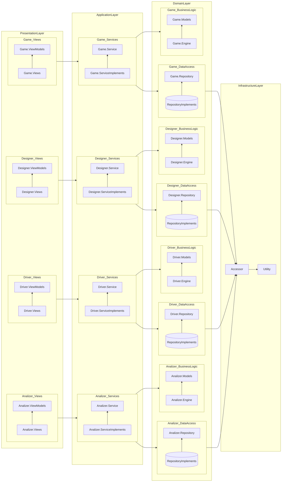

```mermaid
flowchart LR
    
    subgraph PresentationLayer
        subgraph Analizer_Views
            direction BT
            Analizer.Views --> Analizer.ViewModels
        end
        subgraph Driver_Views
            direction BT
            Driver.Views --> Driver.ViewModels
        end
        subgraph Designer_Views
            direction BT
            Designer.Views --> Designer.ViewModels
        end
        subgraph Game_Views
            direction BT
            Game.Views --> Game.ViewModels
        end
    end

    Analizer_Views --> Analizer_Services
    Driver_Views --> Driver_Services
    Designer_Views --> Designer_Services
    Game_Views --> Game_Services

    subgraph ApplicationLayer
        subgraph Analizer_Services
            direction BT
            Analizer.ServiceImplements --> Analizer.Service
        end
        subgraph Driver_Services
            direction BT
            Driver.ServiceImplements --> Driver.Service
        end
        subgraph Designer_Services
            direction BT
            Designer.ServiceImplements --> Designer.Service
        end
        subgraph Game_Services
            direction BT
            Game.ServiceImplements --> Game.Service
        end
    end

    Analizer_Services --> Analizer_BusinessLogic
    Analizer_Services --> Analizer_DataAccess
    Driver_Services --> Driver_BusinessLogic
    Driver_Services --> Driver_DataAccess
    Designer_Services --> Designer_BusinessLogic
    Designer_Services --> Designer_DataAccess
    Game_Services --> Game_BusinessLogic
    Game_Services --> Game_DataAccess

    subgraph DomainLayer
        subgraph Analizer_BusinessLogic
            direction BT
            Analizer.Engine --> Analizer.Models
        end
        subgraph Analizer_DataAccess
            direction BT
            Analizer.RepositoryImplements[("RepositoryImplements")] --> Analizer.Repository
        end
        subgraph Driver_BusinessLogic
            direction BT
            Driver.Engine --> Driver.Models
        end
        subgraph Driver_DataAccess
            direction BT
            Driver.RepositoryImplements[("RepositoryImplements")] --> Driver.Repository
        end
        subgraph Designer_BusinessLogic
            direction BT
            Designer.Engine --> Designer.Models
        end
        subgraph Designer_DataAccess
            direction BT
            Designer.RepositoryImplements[("RepositoryImplements")] --> Designer.Repository
        end
        subgraph Game_BusinessLogic
            direction BT
            Game.Engine --> Game.Models
        end
        subgraph Game_DataAccess
            direction BT
            Game.RepositoryImplements[("RepositoryImplements")] --> Game.Repository
        end
    end
    
    subgraph InfrastructureLayer
        Analizer_DataAccess --> Accessor
        Driver_DataAccess --> Accessor
        Designer_DataAccess --> Accessor
        Game_DataAccess --> Accessor
        Accessor --> Utility
    end
    
```