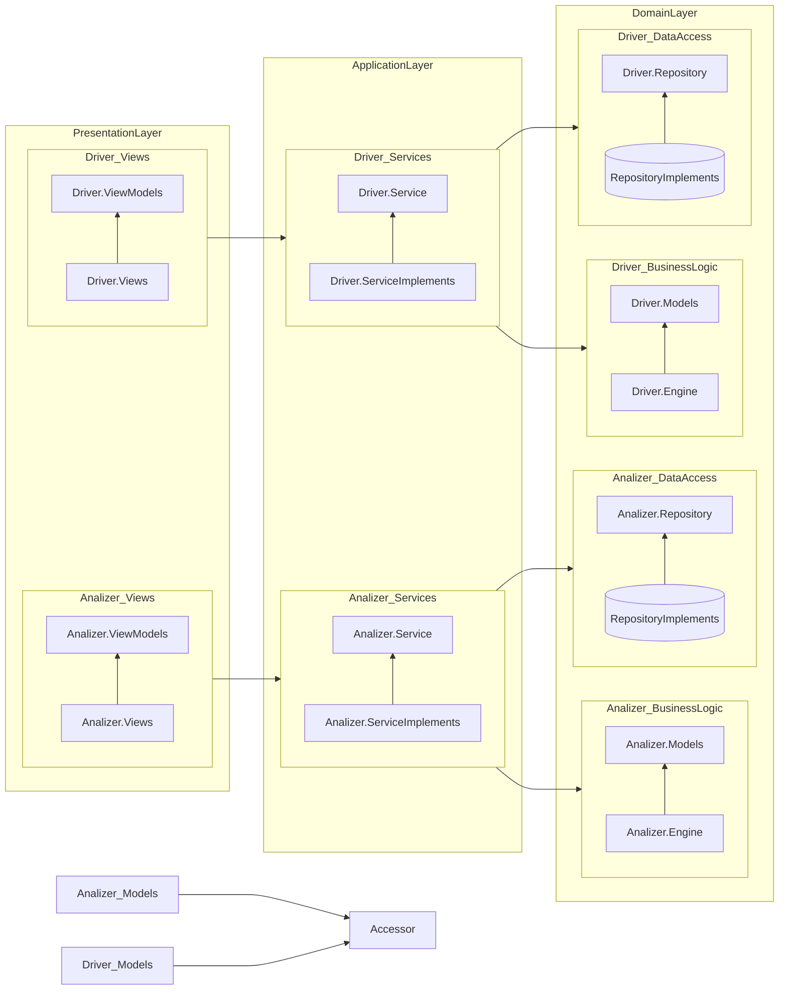

```mermaid
flowchart LR
    
    Analizer_Models --> Accessor
    Analizer_Views --> Analizer_Services
    Driver_Models --> Accessor
    Driver_Views --> Driver_Services
    
    subgraph DomainLayer
        subgraph Analizer_BusinessLogic
            direction BT
            Analizer.Engine --> Analizer.Models
        end
        subgraph Analizer_DataAccess
            direction BT
            Analizer.RepositoryImplements[("RepositoryImplements")] --> Analizer.Repository
        end
        subgraph Driver_BusinessLogic
            direction BT
            Driver.Engine --> Driver.Models
        end
        subgraph Driver_DataAccess
            direction BT
            Driver.RepositoryImplements[("RepositoryImplements")] --> Driver.Repository
        end
    end
    
    subgraph ApplicationLayer
        subgraph Analizer_Services
            direction BT
            Analizer.ServiceImplements --> Analizer.Service
        end
        Analizer_Services --> Analizer_BusinessLogic
        Analizer_Services --> Analizer_DataAccess
        subgraph Driver_Services
            direction BT
            Driver.ServiceImplements --> Driver.Service
        end
        Driver_Services --> Driver_BusinessLogic
        Driver_Services --> Driver_DataAccess
    end

    subgraph PresentationLayer
        direction LR
        subgraph Analizer_Views
            direction BT
            Analizer.Views --> Analizer.ViewModels
        end
        subgraph Driver_Views
            direction BT
            Driver.Views --> Driver.ViewModels
        end
    end
    
    
```