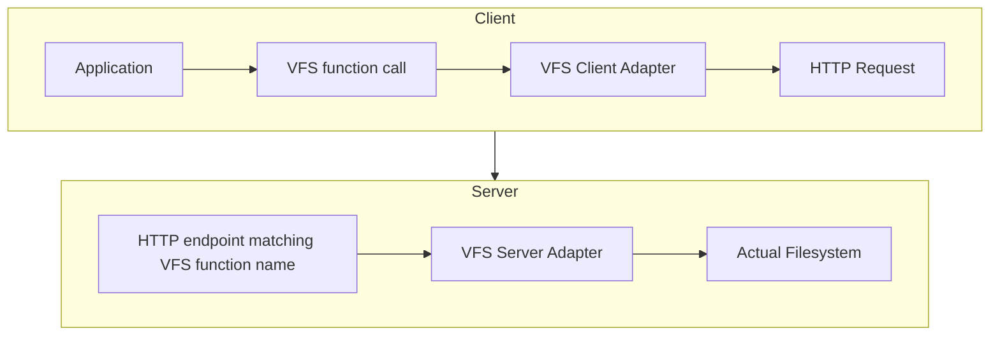

```mermaid
flowchart TD
	subgraph Client
		direction LR
		A1["Application"] --> B1["VFS function call"] --> C1["VFS Client Adapter"] --> D1["HTTP Request"]
	end
	subgraph Server
		direction LR
		A2["HTTP endpoint matching VFS function name"] --> B2["VFS Server Adapter"] --> C2["Actual Filesystem"]
	end

	Client --> Server
```