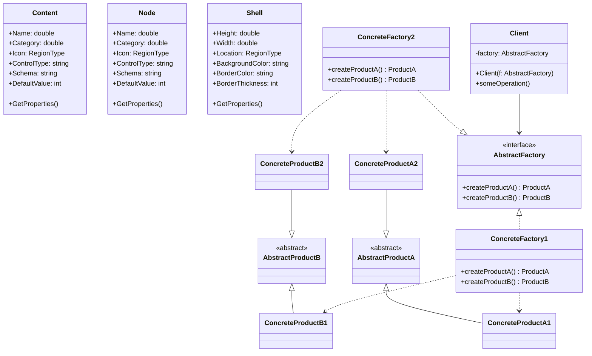
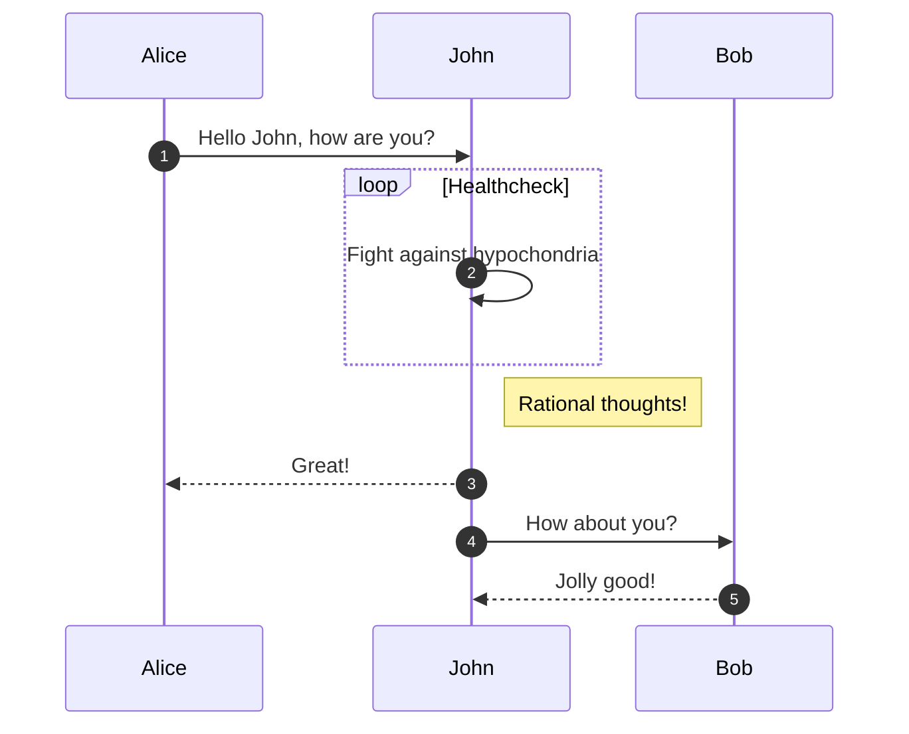

```mermaid
classDiagram
  class Content {
    +Name: double
    +Category: double
    +Icon: RegionType
    +ControlType: string
    +Schema: string
    +DefaultValue: int
    +GetProperties()
  }
  class Node {
    +Name: double
    +Category: double
    +Icon: RegionType
    +ControlType: string
    +Schema: string
    +DefaultValue: int
    +GetProperties()
  }
  class Shell {
    +Height: double
    +Width: double
    +Location: RegionType
    +BackgroundColor: string
    +BorderColor: string
    +BorderThickness: int
    +GetProperties()
  }
  class AbstractProductA {
    <<abstract>>
  }
  AbstractProductA <|-- ConcreteProductA1
  ConcreteProductA2 --|> AbstractProductA

  class AbstractProductB {
    <<abstract>>
  }
  AbstractProductB <|-- ConcreteProductB1
  ConcreteProductB2 --|> AbstractProductB

  class ConcreteFactory1 {
    +createProductA() ProductA
    +createProductB() ProductB
  }
  class AbstractFactory {
    <<interface>>
    +createProductA() ProductA
    +createProductB() ProductB    
  }
  class ConcreteFactory2 {
    +createProductA() ProductA
    +createProductB() ProductB
  }

  AbstractFactory <|.. ConcreteFactory1
  ConcreteFactory2 ..|> AbstractFactory
  
  class Client {
    -factory: AbstractFactory
    +Client(f: AbstractFactory)
    +someOperation()
  }

  ConcreteFactory1 ..> ConcreteProductB1
  ConcreteFactory1 ..> ConcreteProductA1

  ConcreteFactory2 ..> ConcreteProductB2
  ConcreteFactory2 ..> ConcreteProductA2

  Client --> AbstractFactory
```

``` mermaid
sequenceDiagram
  autonumber
  Alice->>John: Hello John, how are you?
  loop Healthcheck
      John->>John: Fight against hypochondria
  end
  Note right of John: Rational thoughts!
  John-->>Alice: Great!
  John->>Bob: How about you?
  Bob-->>John: Jolly good!
```