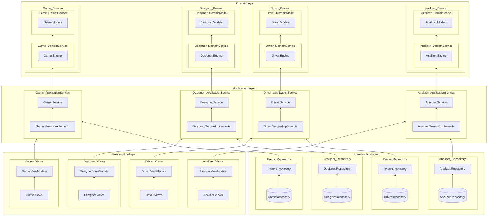

```mermaid
flowchart BT
    
    subgraph PresentationLayer
        subgraph Analizer_Views
            direction BT
            Analizer.Views --> Analizer.ViewModels
        end
        subgraph Driver_Views
            direction BT
            Driver.Views --> Driver.ViewModels
        end
        subgraph Designer_Views
            direction BT
            Designer.Views --> Designer.ViewModels
        end
        subgraph Game_Views
            direction BT
            Game.Views --> Game.ViewModels
        end
    end

    Analizer_Views --> Analizer_ApplicationService
    Driver_Views --> Driver_ApplicationService
    Designer_Views --> Designer_ApplicationService
    Game_Views --> Game_ApplicationService

    subgraph InfrastructureLayer
        subgraph Analizer_Repository
            direction BT
            Analizer.RepositoryImplements[("AnalizerRepository")] --> Analizer.Repository
        end
        subgraph Driver_Repository
            direction BT
            Driver.RepositoryImplements[("DriverRepository")] --> Driver.Repository
        end
        subgraph Designer_Repository
            direction BT
            Designer.RepositoryImplements[("DesignerRepository")] --> Designer.Repository
        end
        subgraph Game_Repository
            direction BT
            Game.RepositoryImplements[("GameRepository")] --> Game.Repository
        end
    end

    Analizer_Repository --> Analizer_ApplicationService
    Driver_Repository --> Driver_ApplicationService
    Designer_Repository --> Designer_ApplicationService
    Game_Repository --> Game_ApplicationService
    

    subgraph ApplicationLayer
        subgraph Analizer_ApplicationService
            direction BT
            Analizer.ServiceImplements --> Analizer.Service
        end
        subgraph Driver_ApplicationService
            direction BT
            Driver.ServiceImplements --> Driver.Service
        end
        subgraph Designer_ApplicationService
            direction BT
            Designer.ServiceImplements --> Designer.Service
        end
        subgraph Game_ApplicationService
            direction BT
            Game.ServiceImplements --> Game.Service
        end
    end

    Analizer_ApplicationService --> Analizer_DomainService
    Driver_ApplicationService --> Driver_DomainService
    Designer_ApplicationService --> Designer_DomainService
    Game_ApplicationService --> Game_DomainService
    
    subgraph DomainLayer
        
        subgraph Analizer_Domain
            direction LR
            subgraph Analizer_DomainService
                direction BT
                Analizer.Engine
            end
            subgraph Analizer_DomainModel
                direction BT
                Analizer.Models
            end
            Analizer_DomainService --> Analizer_DomainModel
        end
        
        subgraph Driver_Domain
            direction LR
            subgraph Driver_DomainService
                direction BT
                Driver.Engine
            end
            subgraph Driver_DomainModel
                direction BT
                Driver.Models
            end
            Driver_DomainService --> Driver_DomainModel
        end

        subgraph Designer_Domain
            direction LR
            subgraph Designer_DomainService
                direction BT
                Designer.Engine
            end
            subgraph Designer_DomainModel
                direction BT
                Designer.Models
            end
            Designer_DomainService --> Designer_DomainModel
        end

        subgraph Game_Domain
            direction LR
            subgraph Game_DomainService
                direction BT
                Game.Engine
            end
            subgraph Game_DomainModel
                direction BT
                Game.Models
            end
            Game_DomainService --> Game_DomainModel
        end
    end
    
    
    
```