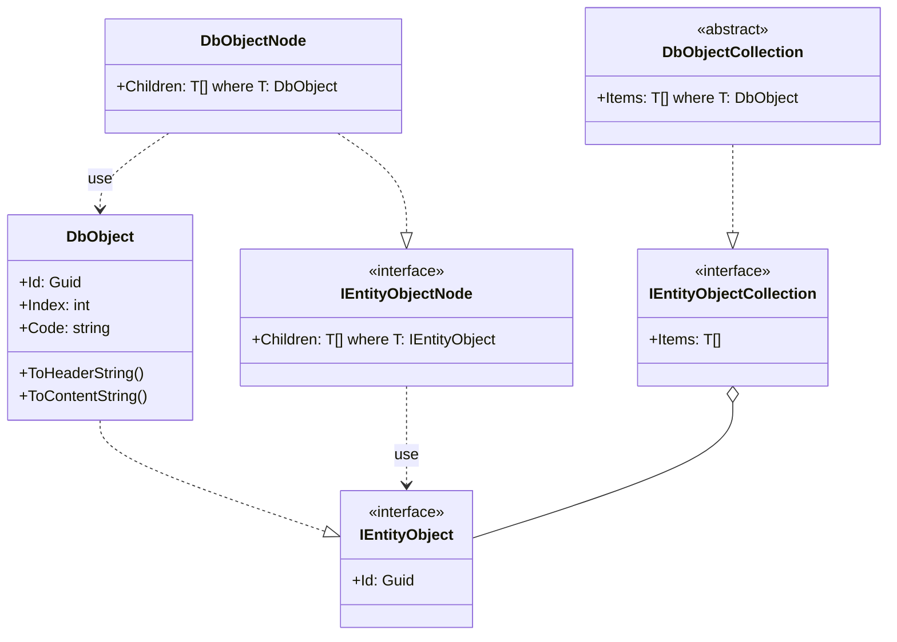

# Schema

    共通のスキーマを定義する

- [unit](#unit) - 単位のスキーマ
- [entityObject](#entityobject) - エンティティのスキーマ

## Unit

---

### Schema

```rb
FileUnit
Type : ValueObject
```

| プロパティ | 型 | 説明 | 例 |
| ---- | ---- | ---- | ---- |
| Path | string | フルパス |  |
| DirName | string | ディレクトリパス |  |
| FileName | string | ファイル名 |  |
| FileExtension | string | 拡張子 |  |

| 関数名 | 引数 | 返数 | 説明 | 例 |
| ---- | ---- | ---- | ---- | ---- |
| IsEmpty() | --- | bool | 空判定 |  |
| IsDir() | --- | bool | ディレクトリパスか判定 |  |
| IsFile() | --- | bool | ファイルパスか判定 |  |
| IsFileName() | --- | bool | ファイル名か判定 |  |
| Exists() | --- | bool | ファイルが存在するか判定 |  |

## EntityObject

---

### Schema

```rb
DbObject
Type : Entity
```

| プロパティ | 型 | 説明 | 例 |
| ---- | ---- | ---- | ---- |
| Id | Guid | データベースの主キー |  |
| Index | int | 並び順のインデックス番号 |  |
| Code | string | キーコード |  |

### Class Diagram

