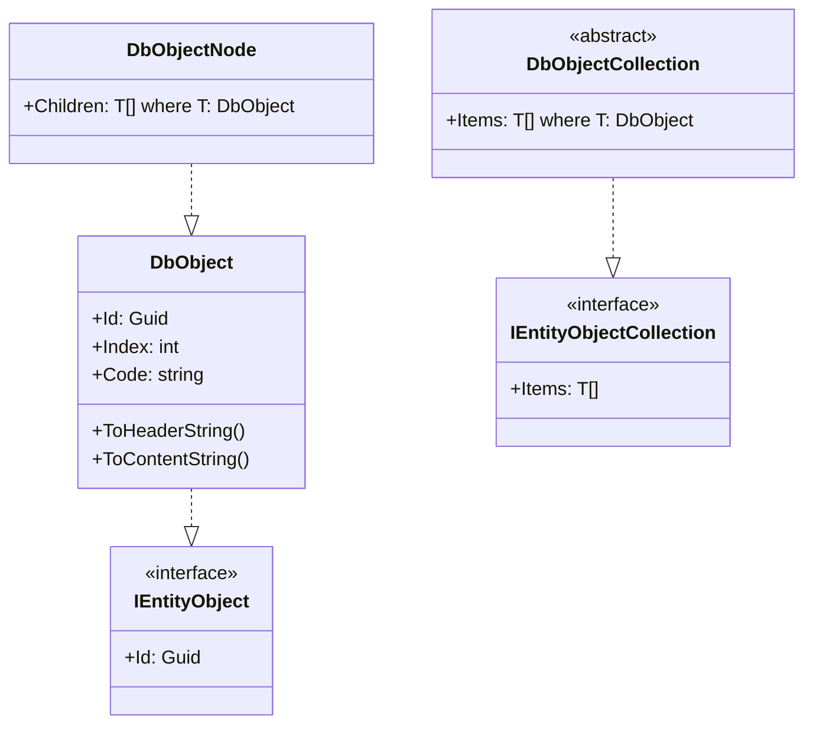

# Schema

## DbObject

### Schema

- DbObject

  | 名称 | 型 | 説明 | 例 |
  | ---- | ---- | ---- | ---- |
  | Id | Guid | データベースの主キー |  |
  | Index | int | 並び順のインデックス番号 |  |
  | Code | string | キーコード |  |

### Class Diagram

