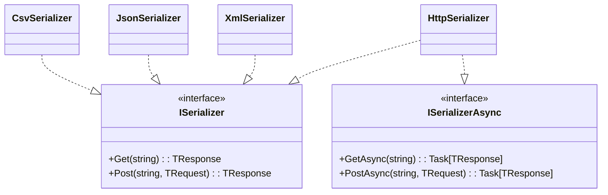
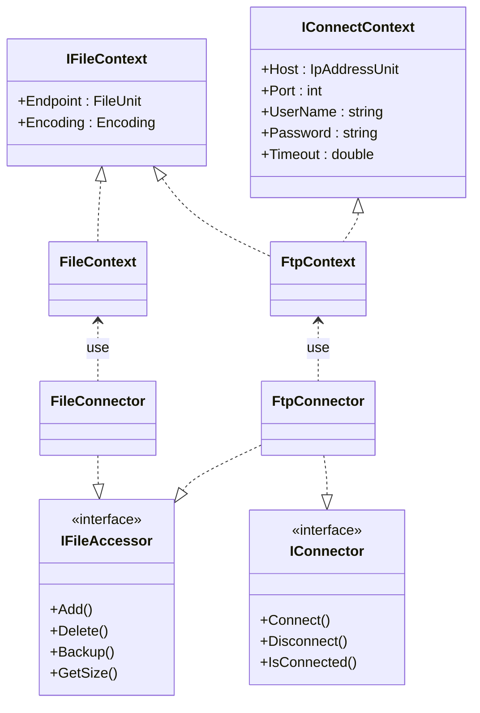

# Accessor

    外部データにアクセスする関数を提供する

- [serializer](#serializer) - 外部データを(デ)シリアライズする関数を提供する.
- [connector](#connector) - 外部データに接続する関数を提供する.
- [watcher](#watcher) - 外部データを監視する関数を提供する.

```rb
References
Assembly : Schema
```

## Serializer

- 外部データを(デ)シリアライズする関数を提供する


---

### Class Diagram



## Connector

- 外部データに接続する関数を提供する


---

### Schema

```rb
IConnect
接続処理
```

| 関数名 | 引数 | 返数 | 説明 | 例 |
| ---- | ---- | ---- | ---- | ---- |
| Connect | --- | --- | 接続する |  |
| Disconnect | --- | --- | 切断する |  |
| IsConnected | --- | --- | 接続判定 |  |

```rb
IFileConnector
ファイルにアクセスして情報取得 / 追加 / 削除を行う
```

| 関数名 | 引数 | 返数 | 説明 | 例 |
| ---- | ---- | ---- | ---- | ---- |
| Add | string |  | ファイルを追加する |  |
| Delete | string |  | ファイルを削除する |  |
| Backup | string |  | バックアップを作成する |  |
| GetSize | string |  | ディレクトリのサイズを取得する |  |

```rb
FtpConnector
ファイルにFTPアクセス
```

| 関数名 | 引数 | 返数 | 説明 | 例 |
| ---- | ---- | ---- | ---- | ---- |
| Connect | string |  | バックアップを作成する |  |
| Disconnect | string |  | ディレクトリのサイズを取得する |  |
| Upload | string |  | バックアップを作成する |  |
| Add | string |  | バックアップを作成する |  |
| Delete | string |  | バックアップを作成する |  |

### Class Diagram



## Watcher

- 外部データを監視する関数を提供する

---
