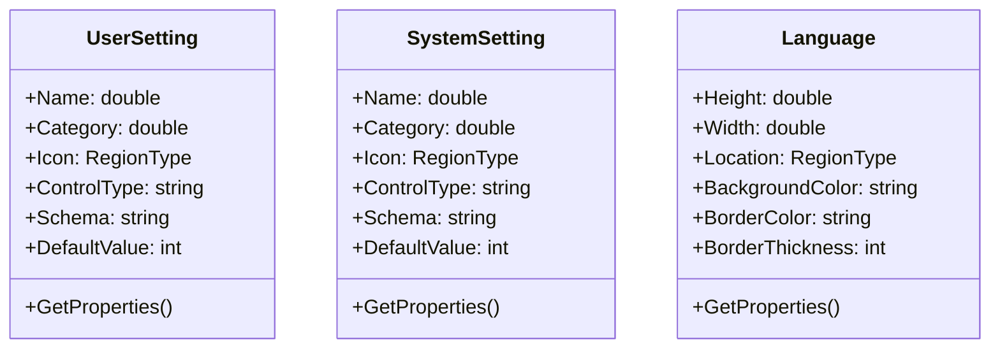
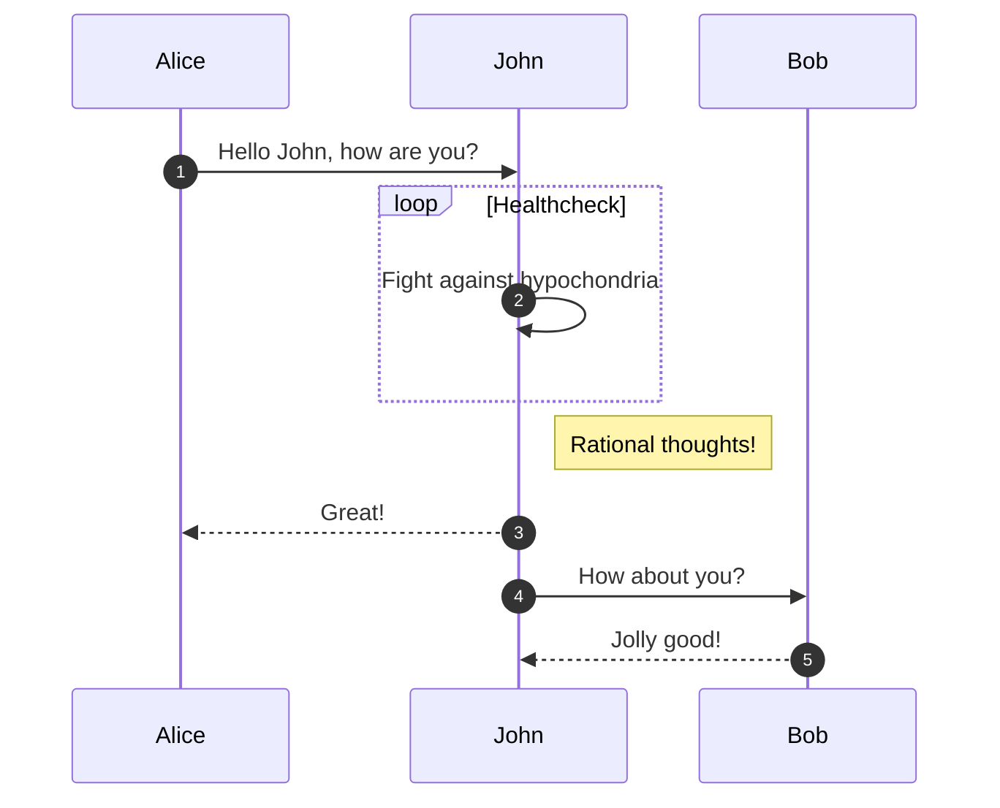

# Configurator

## DomainModel

### スキーマ

- UserSetting

  |  名称  |  型  |  説明  |  例  |
  | ---- | ---- | ---- | ---- |
  |  Category  |  string  |  |  |
  |  Name  |  string  |  |  |

### クラス図

## BusinnessLogic

## UseCase