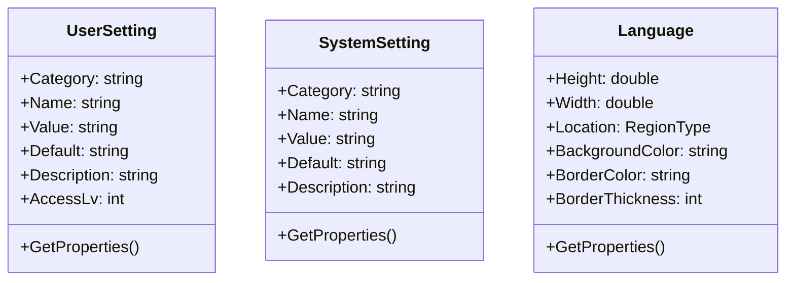

# Configurator

## Domain Model

---

### Schema

- UserSetting

  | 名称 | 型 | 説明 | 例 |
  | ---- | ---- | ---- | ---- |
  | Category | string |  |  |
  | Name | string |  |  |
  | Value | string |  |  |
  | Default | string |  |  |
  | Description | string |  |  |
  | AccessLv | int |  |  |

### Class Diagram

## BusinnessLogic

---

## UseCase

---
