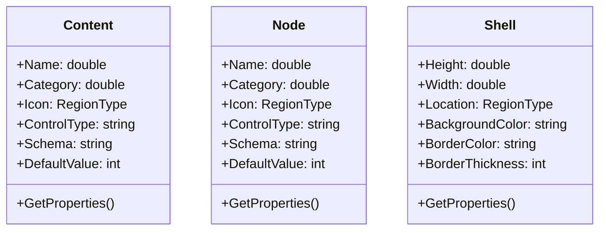

# Designer

## Domain Model

---

### Class Diagram

```mermaid
classDiagram
  class Content {
    +Name: double
    +Category: double
    +Icon: RegionType
    +ControlType: string
    +Schema: string
    +DefaultValue: int
    +GetProperties()
  }
  class Node {
    +Name: double
    +Category: double
    +Icon: RegionType
    +ControlType: string
    +Schema: string
    +DefaultValue: int
    +GetProperties()
  }
  class Shell {
    +Height: double
    +Width: double
    +Location: RegionType
    +BackgroundColor: string
    +BorderColor: string
    +BorderThickness: int
    +GetProperties()
  }
  
```
