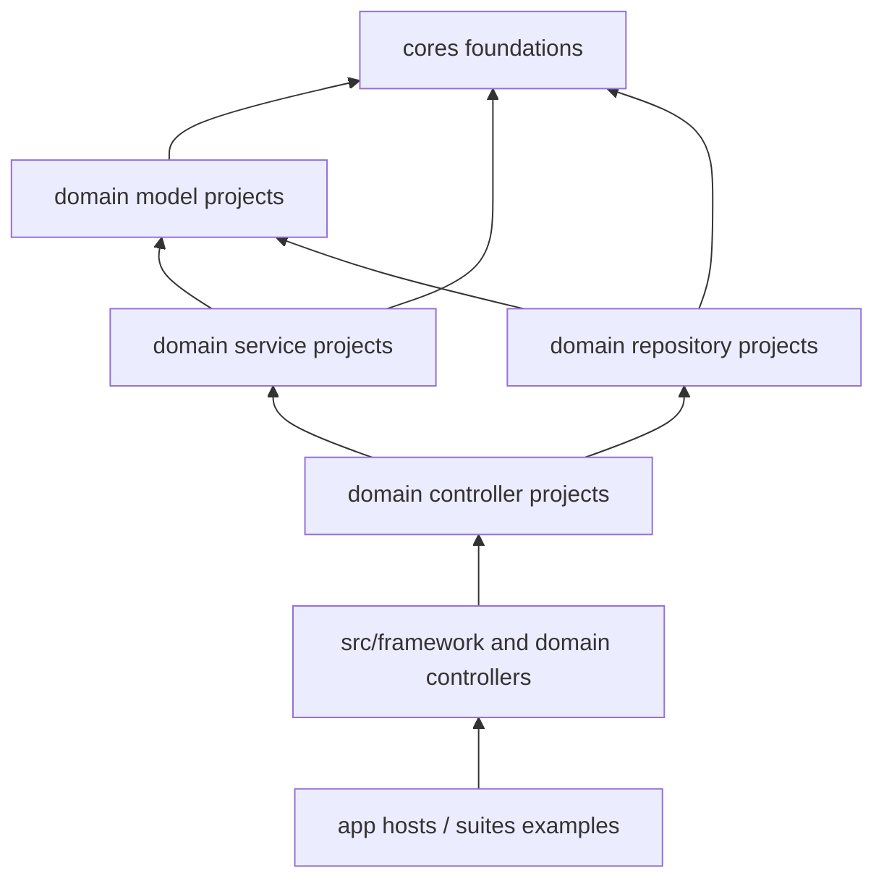

# Mov Frameworks Architecture

## Purpose

`mov/frameworks` is the shared DLL foundation for Mov applications. Code in this area should be reusable across multiple apps and should avoid depending on any single operational app, UI host, deployment shape, or sample workflow.

`mov/suites` is the application and example layer. Suites consume `frameworks` DLLs to show concrete usage through Blazor, React, WPF, console, API, and domain-specific client apps.

## Design Rule

When designing another application, use `frameworks` for stable shared capability and use `suites` as reference implementations.

Promote code into `frameworks` only when:

- the behavior is useful to more than one app;
- the public contract can be described without app-specific UI or deployment assumptions;
- dependencies can remain portable and lower-level than app hosts;
- the behavior fits an existing layer or deserves a new shared project boundary.

Keep code in `suites` when:

- it is a concrete app workflow;
- it is UI composition, navigation, screen state, or host configuration;
- it is a vendor/client integration used by one app;
- it is sample/demo behavior that proves how to consume a DLL.

## Top-Level Structure

| Path | Role |
| --- | --- |
| `frameworks/app` | Runnable hosts for the framework workspace, currently API and console app. |
| `frameworks/cores` | Cross-domain reusable foundations grouped by controller, core, io, model, service, and ui. |
| `frameworks/src` | Domain modules with models, repository, service, controller, and aggregate framework/usecase packages. |
| `frameworks/lib` | Higher-level convenience DLL that references framework and command packages. |
| `frameworks/mov.sln` | Visual Studio solution for the framework foundation. |

## Layer Vocabulary

The existing project layout uses a consistent layer vocabulary:

- `models`: domain/data models and domain-specific value structures.
- `repository`: persistence and data-access abstractions or implementations.
- `service`: reusable domain/application services.
- `controller`: orchestration and API-facing control logic.
- `app`: runnable hosts and entry points.
- `cores`: cross-domain primitives and shared reusable packages.

Prefer this vocabulary when moving or adding projects.

## Dependency Direction

The intended direction is:



Avoid dependencies from `frameworks` back into `suites`.

## Core Packages

`frameworks/cores` contains reusable cross-domain packages:

| Area | Projects |
| --- | --- |
| `controller` | `Authorizers`, `Configurators`, `Schedulers`, `SpreadSheets`, `Translators` |
| `core` | `Core` |
| `io` | `Accessors`, `Errors`, `Loggers`, `Repositories`, `Resources` |
| `model` | `Characters`, `Documents`, `Locations`, `Maths`, `Products`, `Robots`, `Shields`, `Styles`, `Valuables` |
| `service` | `Learnings`, `Sequencers`, `Statistics`, `Stores`, `Transactions` |
| `ui` | `Charts`, `Commands`, `Graphicers`, `Layouts` |

Most core packages target `netstandard2.0` so they can be reused from different app hosts.

## Domain Packages

`frameworks/src` contains domain packages:

| Domain | Projects |
| --- | --- |
| `analizer` | `Analizer.Models`, `Analizer.Repository`, `Analizer.Service`, `Analizer.Controller`, `Analizer.Test` |
| `bom` | `Bom.Models`, `Bom.Repository`, `Bom.Service`, `Bom.Controller` |
| `calendar` | `Calendar.Models`, `Calendar.Repository`, `Calendar.Service`, `Calendar.Controller` |
| `designer` | `Designer.Models`, `Designer.Repository`, `Designer.Service`, `Designer.Controller`, `Designer.Test` |
| `drawer` | `Drawer.Models`, `Drawer.Repository`, `Drawer.Service`, `Drawer.Controller` |
| `driver` | `Driver.Models`, `Driver.Repository`, `Driver.Service`, `Driver.Controller` |
| `game` | `Game.Models`, `Game.Repository`, `Game.Service`, `Game.Controller`, `Game.Test` |
| `imaging` | `Imaging.Models`, `Imaging.Repository`, `Imaging.Service`, `Imaging.Controller` |
| `mobility` | `Mobility.Models`, `Mobility.Repository`, `Mobility.Service`, `Mobility.Controller` |
| aggregate | `Framework`, `UseCase` |

The aggregate `Framework` project references the domain controller projects and selected core controller packages. Use it when an app wants the broad framework surface instead of individual domain DLLs.

## Target Frameworks

- Shared libraries are mostly `netstandard2.0`.
- Framework app hosts target `.NET 7`.
- Tests target `.NET 7` and use NUnit.

Preserve `netstandard2.0` for common foundation packages unless a dependency or API requires a newer target.

## Design Workflow For Other Apps

Before designing a new app that will consume Mov foundations:

1. Read this architecture document.
2. Identify the domain packages the app needs.
3. Prefer the narrowest DLL set before referencing the aggregate `Framework` package.
4. Check `suites` for an operational example of the same domain.
5. Keep app UI, host configuration, and deployment choices outside `frameworks`.
6. Promote new shared code to `frameworks` only after the reusable contract is stable.

## Verification

For framework changes:

```powershell
dotnet build frameworks\mov.sln
dotnet test frameworks\mov.sln
```

If public contracts used by examples change, also verify:

```powershell
dotnet build suites\mov_suite.sln
dotnet test suites\mov_suite.sln
```

